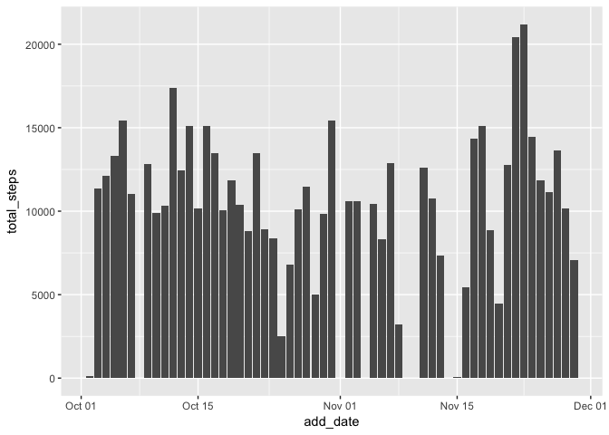
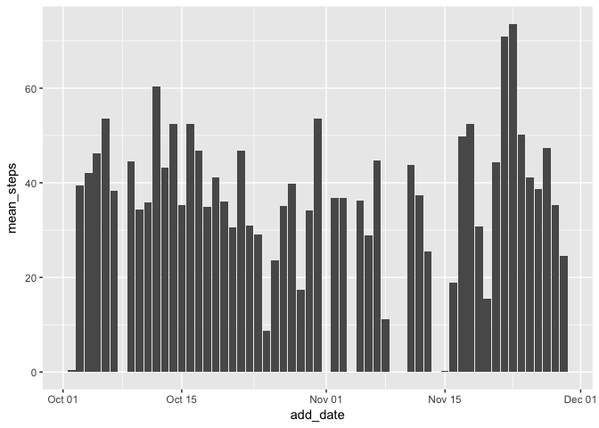
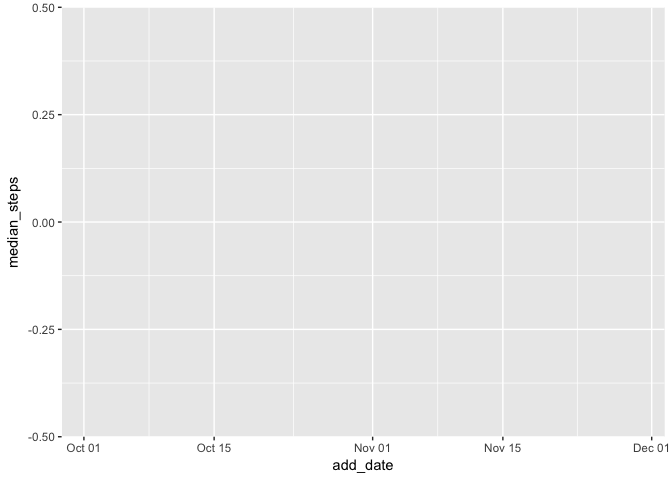
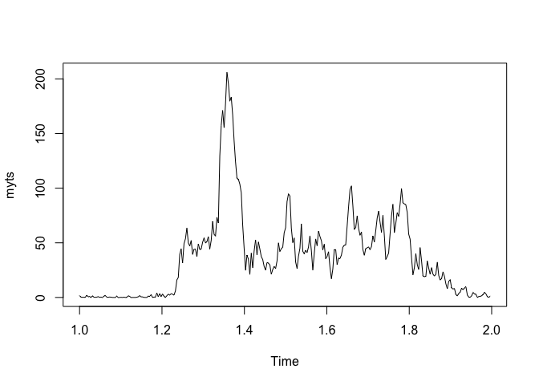
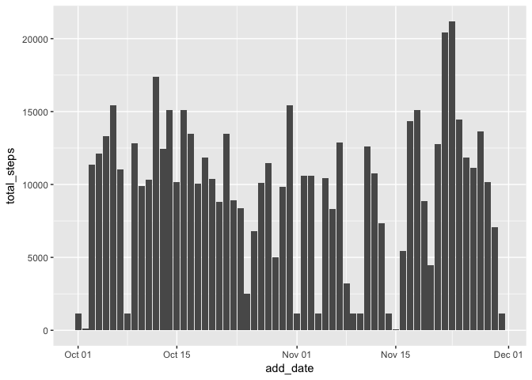
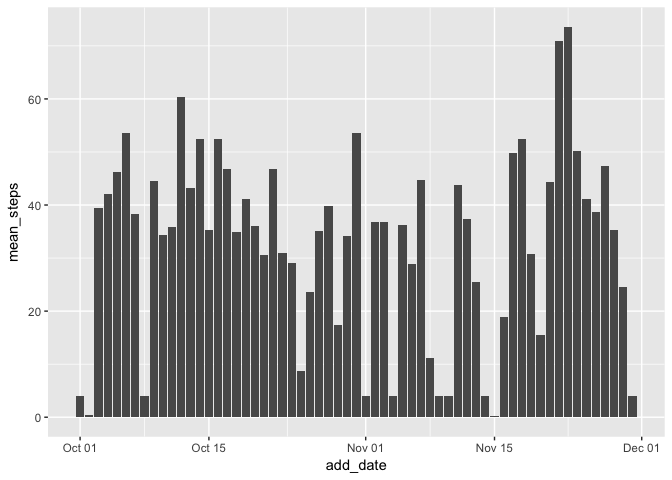
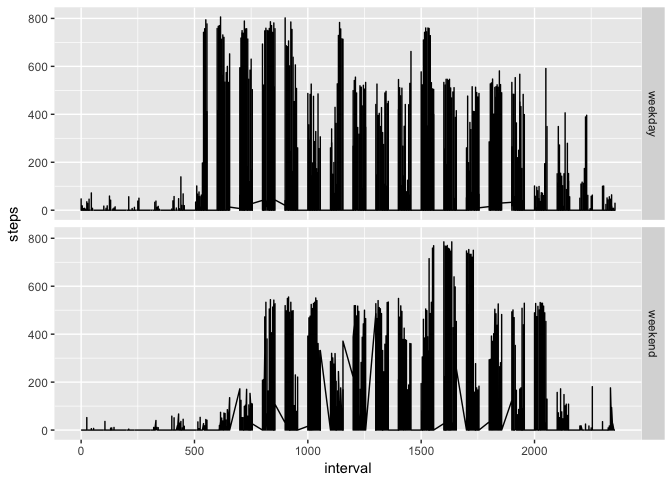

# CourseProject1

## This is the solution for wk.2 peer-graded assessment
## Course: Reproducible Research

### By Kees Eveleens Maarse


1. Reading in and processing the data

I made sure the steps are read in as numeric, and I converted the date to a
'real' date, so that I can carry out all tasks as required.  


```r
library(tidyverse)
```

```
## Loading tidyverse: ggplot2
## Loading tidyverse: tibble
## Loading tidyverse: tidyr
## Loading tidyverse: readr
## Loading tidyverse: purrr
## Loading tidyverse: dplyr
```

```
## Conflicts with tidy packages ----------------------------------------------
```

```
## filter(): dplyr, stats
## lag():    dplyr, stats
```

```r
library(ggplot2)

mydata <- read.csv("activity.csv",colClasses = c("steps"="numeric"))
mydata$date <- paste(as.character(mydata$date),' 000000',sep='')
mydata$add_date <- as.POSIXct(mydata$date, format='%Y-%m-%d %H%M%S')
```

2. Produce a histogram of the total number of steps each day


```r
mydata %>%
  group_by(add_date) %>%
  summarise(total_steps = sum(steps)) %>%
  ggplot(aes(x=add_date, y=total_steps)) + geom_bar(stat = "identity") 
```

```
## Warning: Removed 8 rows containing missing values (position_stack).
```

<!-- -->

3. Produce histograms of the mean and the median of the number of steps each day


```r
mydata %>%
  group_by(add_date) %>%
  summarise(mean_steps = mean(steps)) %>%
  ggplot(aes(x=add_date, y=mean_steps)) + geom_bar(stat = "identity")
```

```
## Warning: Removed 8 rows containing missing values (position_stack).
```

<!-- -->

```r
mydata %>%
  group_by(add_date) %>%
  summarise(median_steps = median(steps)) %>%
  ggplot(aes(x=add_date, y=median_steps)) + geom_bar(stat = "identity")
```

```
## Warning: Removed 8 rows containing missing values (position_stack).
```

<!-- -->

4. Produce a time series plot of the average number of steps, per time period


```r
mydata_interval <- group_by(mydata, interval)
mydata_int_mean <- summarise(mydata_interval,average=mean(steps, na.rm=TRUE))
myts <- ts(mydata_int_mean$average, frequency=24*12)
plot(myts)
```

<!-- -->

5. The time interval that has on average the maximum number of steps 


```r
max(myts)
```

```
## [1] 206.1698
```

6a. Calculate the number of occurences with missing data


```r
nrow(mydata) - nrow(na.omit(mydata))
```

```
## [1] 2304
```

6b. Fill in the missing data
I decide to use the median value of the interval; that seemed an appropriate way
to fill in the missing data.


```r
library(data.table)
```

```
## -------------------------------------------------------------------------
```

```
## data.table + dplyr code now lives in dtplyr.
## Please library(dtplyr)!
```

```
## -------------------------------------------------------------------------
```

```
## 
## Attaching package: 'data.table'
```

```
## The following objects are masked from 'package:dplyr':
## 
##     between, first, last
```

```
## The following object is masked from 'package:purrr':
## 
##     transpose
```

```r
DT <- data.table(mydata)
setkey(DT, interval)
DT[,steps := ifelse(is.na(steps), median(steps, na.rm=TRUE), steps), by=interval]
```

7. Histograms of the mean and the median of the number of steps each day, now with missing data filled in


```r
DT %>%
  group_by(add_date) %>%
  summarise(total_steps = sum(steps)) %>%
  ggplot(aes(x=add_date, y=total_steps)) + geom_bar(stat = "identity")
```

<!-- -->

```r
DT %>%
  group_by(add_date) %>%
  summarise(mean_steps = mean(steps)) %>%
  ggplot(aes(x=add_date, y=mean_steps)) + geom_bar(stat = "identity")
```

<!-- -->

8. Panel plot comparing average number of step throughout the day, weekdays vs. weekends. 
So: first add a column showing whether it's a weekend or a weekday, make it a factor value. Then, produce a faceted diagram.


```r
DT$weekend <- ifelse(weekdays(DT$add_date) %in% c("Saturday", "Sunday"), "weekend", "weekday")
DT$weekend <- as.factor(DT$weekend)
ggplot(DT, aes(x = interval, y = steps, group = weekend)) +
     geom_line() +
     facet_grid(weekend ~.)
```

<!-- -->

### End
